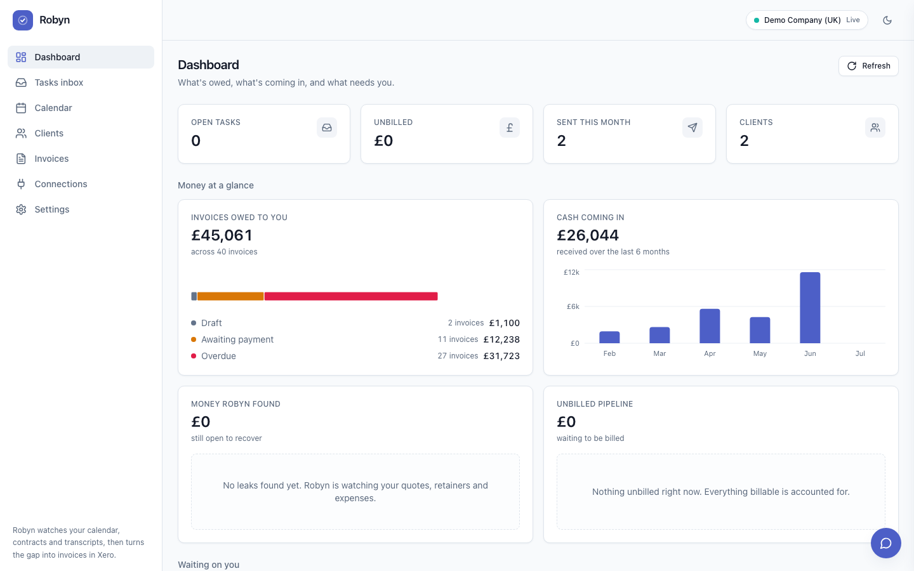
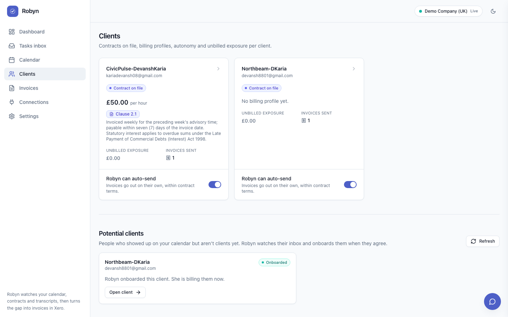
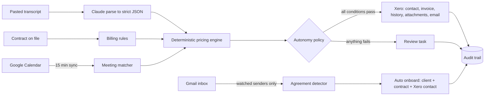
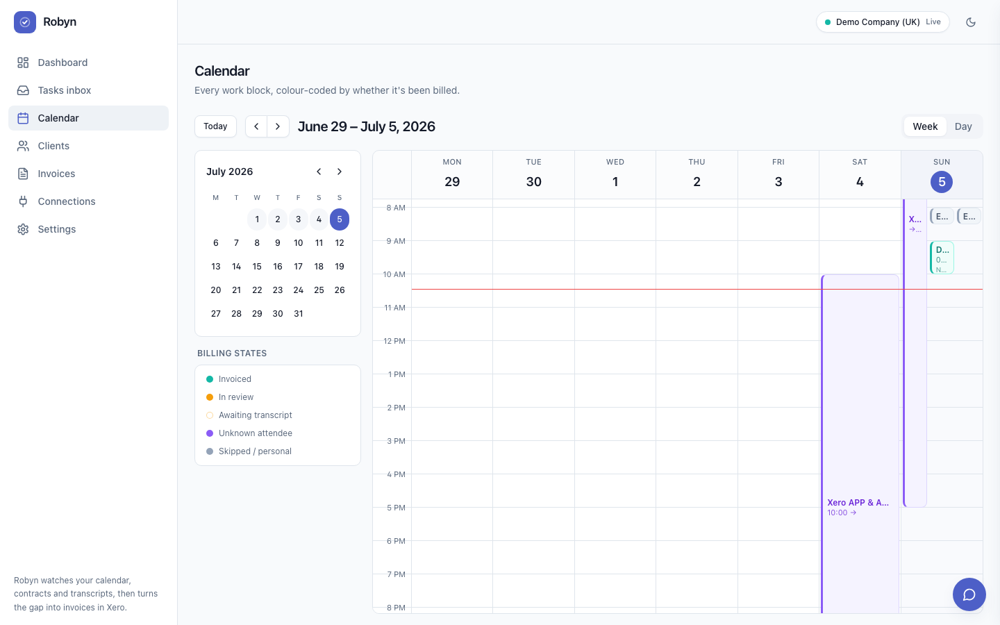
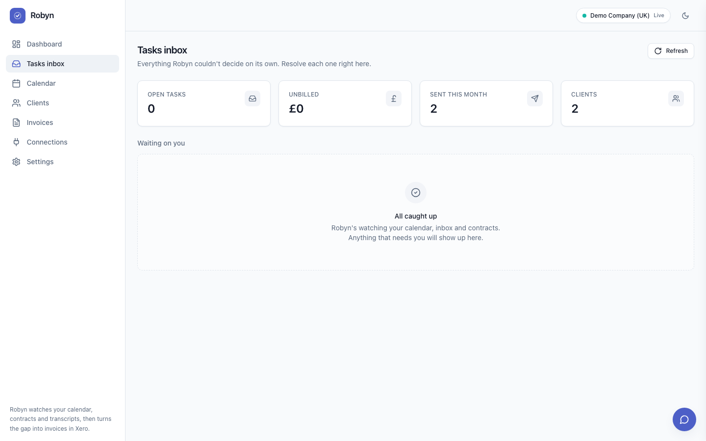
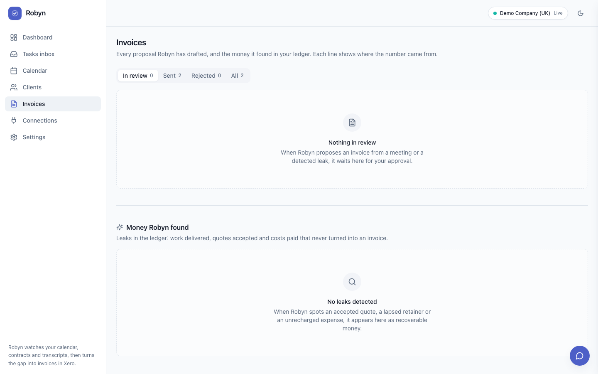
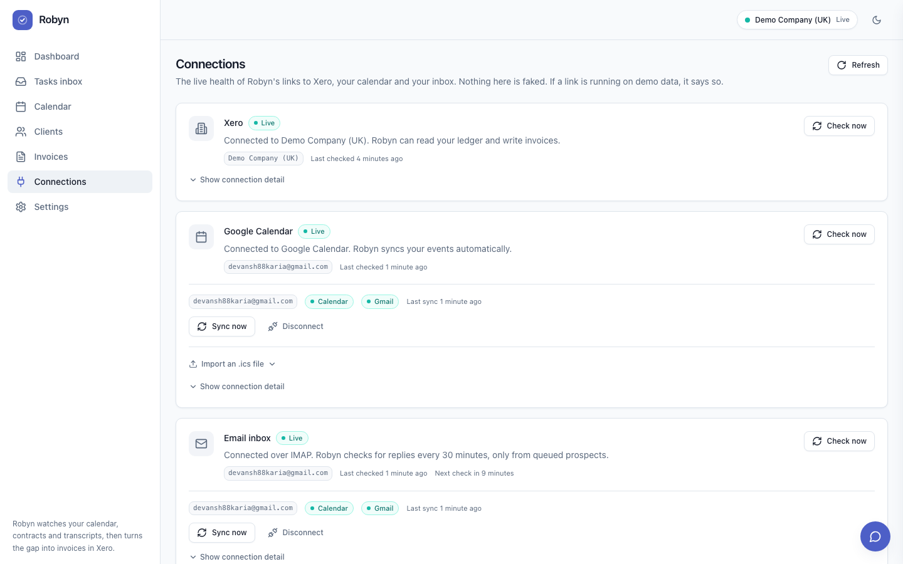

# Robyn

**Your calendar already knows what you should have billed. Robyn turns it into Xero invoices.**

%20live-13B5EA?logo=xero&logoColor=white)


-CC785C)


Built for the Encode x Xero hackathon.



---

## The problem

Freelancers and small consultancies leak money in three places. Meetings happen and never become invoices. Work agreed in a call ("can you also review that pull request") never lands on any invoice. And new clients take days of admin to onboard. None of this is a bookkeeping problem. It is a memory problem, and the evidence already exists in the calendar, the inbox and the meeting transcript.

## What Robyn does

Robyn connects a real Google Calendar, a real Gmail inbox and a real Xero org, then runs three loops:

1. **Calendar to invoice.** Every synced meeting is matched to a client by attendee email. When the transcript arrives, Robyn prices the meeting from the client's contract and catches billable work mentioned in conversation that never made it onto an invoice.
2. **Transcript scope capture.** Claude parses the transcript into strict JSON at the edge. A deterministic pricing engine turns each billable item into invoice lines using the contract's own billing rules: base rate, reduced rate tiers, minimum blocks, rounding, payment terms. A 15 minute code review becomes one 30 minute minimum block at the contract rate, cited to the exact clause.
3. **Email to client.** Unknown meeting attendees are queued as potential clients, and Robyn watches the inbox for exactly those senders and nobody else. When a signed agreement PDF arrives, Robyn parses it, creates the client, files the contract with its billing profile, and creates the Xero contact. Zero forms.

When a client has autonomy switched on and the policy passes, the invoice goes to Xero as AUTHORISED and Xero emails it to the client with no human clicks. When any condition fails, the proposal drops to a review task instead. There is no third path.

> **The invariant:** every agent behaviour is a state transition that either writes to Xero or raises a task. The LLM parses and proposes. It never decides and never sends. Decisions belong to a deterministic, unit tested engine, and every verdict, approval, exception and Xero write creates an audit event.

## Proven live, end to end

This ran against a real calendar, a real inbox and the real Xero Demo Company (UK) with zero clicks:

- A real meeting synced in, matched the client by attendee email, and its pasted transcript revealed 15 minutes of uninvoiced review work. Robyn priced it from the contract (30 minute minimum block, Clause 3), the policy cleared all five autonomy conditions, and **INV-0073 was written to Xero as AUTHORISED** with the decision note in History and the transcript and contract clause attached as evidence.
- A prospect from a discovery call emailed a signed agreement PDF. Robyn read it (it only ever reads watched senders), parsed 12 clauses plus the structured billing profile, promoted the prospect to a client and **created the Xero contact**, all recorded on the audit trail.



## How it works



- **LLM at the edges only.** Claude turns transcripts, contracts and agreement PDFs into zod validated JSON. Fuzzy client matches are proposals. The engine and policy are pure TypeScript with 79 unit tests and zero model calls.
- **Idempotent Xero writes.** Invoices are check by reference before create, contacts are ensured by email then name, and the whole money moment is one composed write that is safe to re run.
- **Rate limit aware.** Batched reads, Postgres caching, hard timeouts on every outbound call, and fail fast handling for daily limit responses. The app stays useful even while Xero is cooling down.
- **Honest connections.** The Connections screen tells the truth: live, fallback or down, per link. Nothing in a demo path is mocked.

## Screenshots

| Calendar, colour coded by billing state | Tasks inbox |
| --- | --- |
|  |  |

| Invoices with line provenance | Connection health |
| --- | --- |
|  |  |

## Xero API usage

Auth is a Xero **Custom Connection** (OAuth 2.0 client credentials) against the Demo Company (UK).

| Endpoint | Methods | What it does in Robyn |
| --- | --- | --- |
| `/connect/token` (identity) | POST | Client credentials token, single flight with granular scope fallback |
| `/connections`, `/Organisation` | GET | Live health probe for the Connections screen |
| `/Contacts` | GET, POST | Find by email or name, create on onboarding (idempotent ensure) |
| `/Invoices` | GET, POST | Check by reference, create ACCREC, move to AUTHORISED |
| `/Invoices/{id}/Email` | POST | Xero emails the authorised invoice to the client |
| `/Invoices/{id}/History` | GET, PUT | Robyn's decision note lands in the invoice history |
| `/Invoices/{id}/Attachments/{file}` | GET, PUT | Transcript excerpt and contract clause attached as evidence |
| `/Payments` | GET, PUT | Retainer cadence and payment gaps for leak detection |
| `/Quotes` | GET | Accepted quote versus invoiced work comparison |
| `/Accounts` | GET | Default sales account resolution for invoice lines |
| `/Reports/AgedReceivablesByContact` | GET | The "money walking away" strip on the dashboard |

**Scopes** (granular set granted to the Custom Connection): `accounting.invoices`, `accounting.contacts`, `accounting.attachments`, `accounting.payments`, `accounting.settings.read`, `accounting.reports.aged.read`, `accounting.reports.profitandloss.read`, `accounting.reports.balancesheet.read`. The token module requests the broad set first and falls back to granular automatically.

## Architecture

```
api/   NestJS 10, TypeORM, PostgreSQL. Owns the engine, policy, Xero, Google and LLM modules.
web/   Next.js 14 App Router, Tailwind, shadcn/ui, recharts.
seed/  Demo seeding, live run staging and drain scripts.
```

The OpenAPI contract is the only interface between backend and frontend. Every endpoint is decorated, the spec is committed at `api/openapi.json`, and `web/lib/api-types.ts` is generated from it and never hand edited. All inbound DTOs are validated with class-validator and every LLM output is validated with zod before it crosses a boundary.

The agent side ships too: a streaming chat over live Xero and local data with 13 read only tools, web search, user added remote MCP servers, editable system prompt and per conversation audit events. The chat is strictly read only. It can look at everything and touch nothing.

## Run it

```bash
make db                          # PostgreSQL in docker
pnpm install
pnpm --filter robyn-api seed     # demo data, plus Xero seeding when creds are live
pnpm dev                         # api on :3000 (docs at /api/docs), web on :3001
```

Credentials go in `api/.env` (asserted non empty at boot, never committed): Xero Custom Connection client id and secret, an Anthropic API key, and optionally Google OAuth credentials for live calendar and Gmail. Without Google credentials the calendar and inbox run on honest, clearly labelled fallbacks.

The full live demo script, including two ready to paste transcript sets, lives in [`demo-assets/RUNBOOK-live-litmus.md`](demo-assets/RUNBOOK-live-litmus.md) and [`demo-assets/transcripts/`](demo-assets/transcripts/).

## Built with

Two agents built this side by side: Claude Code (Anthropic) owned the backend, the engine and the integrations, and Cursor owned the frontend, coordinating through the committed OpenAPI contract and a shared context file. Claude models via the Anthropic API also run inside the product for transcript, contract and email parsing and for the agent chat.
